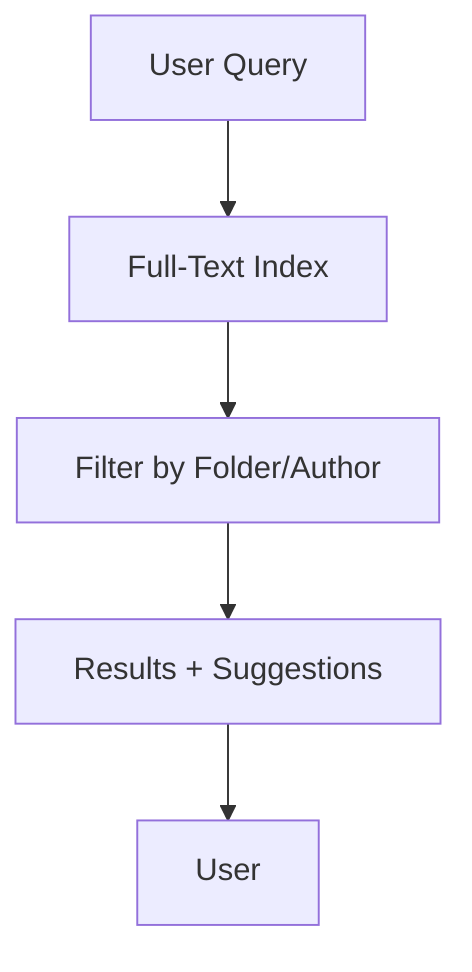

## Overview

Bragly provides a comprehensive set of tools for managing your project documentation. You can organize content into structured folders, collaborate with teams using granular permissions, track changes through version history, and discover information quickly with powerful search features. These core capabilities ensure your docs stay organized, accessible, and up-to-date.

<Columns cols={2}>
  <Card title="Organize Projects" icon="folder" href="#project-organization">
    Structure your documentation with nested folders and intuitive navigation.
  </Card>
  <Card title="Collaborate Securely" icon="users" href="#collaboration">
    Invite team members and control access levels precisely.
  </Card>
  <Card title="Track Changes" icon="git-branch" href="#version-history">
    Maintain version history and edit collaboratively without conflicts.
  </Card>
  <Card title="Search Efficiently" icon="search" href="#search">
    Find content instantly across your entire documentation space.
  </Card>
</Columns>

## Project Organization and Folders

Organize your documentation projects using a flexible folder system. Create nested folders to group related pages, such as API references, user guides, and release notes. Bragly supports drag-and-drop reorganization, making it easy to maintain a logical structure as your project grows.

<Steps>
  <Step title="Create a Folder" icon="plus">
    Navigate to your workspace root and select **New Folder**. Name it descriptively, like `API Reference`.
  </Step>
  <Step title="Add Pages" icon="file-text">
    Inside the folder, create new pages or move existing ones. Use the sidebar for quick navigation.
  </Step>
  <Step title="Reorder Content" icon="move">
    Drag folders and pages to rearrange. Nested structures support up to 10 levels deep.
  </Step>
</Steps>

<Callout kind="tip">
  Use consistent naming conventions, like prefixing with numbers (`01-Getting-Started`), to enforce order.
</Callout>

## Collaboration and Permissions

Invite team members to collaborate on documentation. Bragly offers role-based permissions: Viewer (read-only), Editor (edit content), Admin (manage users and settings). Assign permissions at the workspace, folder, or page level for precise control.

<Tabs>
  <Tab title="Workspace Permissions" icon="globe">
    Set global access for all content.
    
    | Role   | Can View | Can Edit | Manage Users |
    |--------|----------|----------|--------------|
    | Viewer | ✅       | ❌       | ❌           |
    | Editor | ✅       | ✅       | ❌           |
    | Admin  | ✅       | ✅       | ✅           |
  </Tab>
  <Tab title="Folder Permissions" icon="folder">
    Override workspace settings per folder. Ideal for restricting sensitive docs like internal APIs.
  </Tab>
</Tabs>

## Version History and Editing

Every edit creates a new version, allowing you to track changes, revert mistakes, and review contributions. Use the visual diff viewer to compare versions side-by-side. Real-time editing supports multiple users without conflicts via operational transformation.

<Expandable title="Advanced Editing Features" default-open="false">
  - **Rich Text Editor**: Supports Markdown, embeds, and code blocks.
  - **Comments**: Inline feedback on specific sections.
  - **Export Versions**: Download as PDF or Markdown.
</Expandable>

Here's an example of fetching version history via API:

<CodeGroup tabs="JavaScript,Python">
  ```javascript
  const response = await fetch('https://api.example.com/docs/project/versions', {
    headers: { Authorization: `Bearer ${YOUR_API_KEY}` }
  });
  const versions = await response.json();
  console.log(versions);
  ```
  ```python
  import requests
  response = requests.get(
      'https://api.example.com/docs/project/versions',
      headers={'Authorization': f'Bearer {YOUR_API_KEY}'}
  )
  versions = response.json()
  print(versions)
  ```
</CodeGroup>

## Search and Content Discovery

Bragly's search indexes all content in real-time, including full-text, titles, and tags. Filter results by folder, author, or date. Advanced discovery features include related content suggestions and saved searches.



<Callout kind="info">
  Pro tip: Tag pages with keywords like `api`, `tutorial` to improve discovery.
</Callout>

These features work together to streamline your documentation workflow. Start by organizing a sample project, then invite collaborators to see permissions in action.