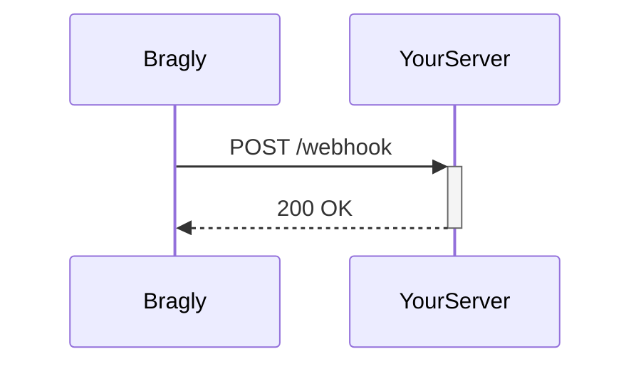

## Overview

Bragly supports seamless integrations with popular third-party services, a robust REST API, webhooks for real-time automation, and flexible export/import options. Use these features to connect your documentation workflow with tools like GitHub, Slack, and Zapier. Start by exploring available integrations, then dive into API endpoints for custom automation.

<Callout kind="tip">
Review the [Quickstart](/quickstart) guide before setting up integrations to ensure your Bragly project is ready.
</Callout>

## Third-Party Integrations

Connect Bragly to external apps for notifications, version control, and automation. Bragly offers native integrations with leading services.

<Columns cols={3}>
  <Card title="GitHub" icon="github" href="https://github.com">
    Sync documentation repos and trigger builds on updates.
  </Card>
  <Card title="Slack" icon="message-circle" href="#">
    Receive real-time notifications for project changes and approvals.
  </Card>
  <Card title="Zapier" icon="zap" href="https://zapier.com">
    Build no-code automations with 5000+ apps.
  </Card>
</Columns>

## Setting Up an Integration

Follow these steps to connect GitHub as an example.

<Steps>
  <Step title="Navigate to Integrations" icon="settings">
    Go to your project settings and select the Integrations tab.
  </Step>
  <Step title="Authorize GitHub" icon="github">
    Click "Connect GitHub" and authorize the app in your GitHub account.
  </Step>
  <Step title="Configure Events" icon="sliders">
    Choose events like doc updates or publishes to sync.
  </Step>
  <Step title="Test Connection" icon="check-circle">
    Run a test sync to verify the integration works.
  </Step>
</Steps>

## API Endpoints

Bragly's REST API lets you manage docs programmatically. Base URL: `https://api.example.com/v1`.

### Create a Document

<Request tabs="JavaScript,cURL" show-lines="true">
  ```javascript
  const response = await fetch('https://api.example.com/v1/docs', {
    method: 'POST',
    headers: {
      'Authorization': `Bearer ${YOUR_API_KEY}`,
      'Content-Type': 'application/json'
    },
    body: JSON.stringify({
      title: 'New Doc',
      content: 'Hello from API'
    })
  });
  ```
  ```bash
  curl -X POST https://api.example.com/v1/docs \
    -H "Authorization: Bearer YOUR_API_KEY" \
    -H "Content-Type: application/json" \
    -d '{"title":"New Doc","content":"Hello from API"}'
  ```
</Request>

<Response tabs="200">
  ```json
  {
    "id": "doc_123abc",
    "title": "New Doc",
    "content": "Hello from API",
    "created_at": "2024-10-15T10:00:00Z"
  }
  ```
</Response>

<ParamField path="title" param-type="string" required="true">
  Document title, max 255 characters.
</ParamField>

<ParamField body="content" param-type="string" required="true">
  Markdown content for the document.
</ParamField>

<ParamField header="Authorization" param-type="string" required="true">
  Bearer token obtained from your API settings.
</ParamField>

## Webhooks for Automation

Set up webhooks to receive events like doc publishes. Configure the webhook URL in project settings.



Handle incoming payloads with this example:

<CodeGroup tabs="Node.js,Python">
  ```javascript
  app.post('/webhook', (req, res) => {
    const event = req.headers['x-bragly-event'];
    const payload = req.body;
    
    if (event === 'doc.published') {
      console.log('Doc published:', payload.doc_id);
      // Trigger your automation
    }
    
    res.status(200).send('OK');
  });
  ```
  ```python
  from flask import Flask, request
  
  app = Flask(__name__)
  
  @app.route('/webhook', methods=['POST'])
  def webhook():
      event = request.headers.get('X-Bragly-Event')
      payload = request.json
      
      if event == 'doc.published':
          print(f"Doc published: {payload['doc_id']}")
          # Trigger automation
      
      return 'OK', 200
  ```
</CodeGroup>

## Export and Import Options

Export docs to various formats or import from external sources.

<Tabs>
  <Tab title="Export" icon="download">
    Use the API or UI to export as Markdown, PDF, or HTML.
    
    ```bash
    curl -H "Authorization: Bearer YOUR_API_KEY" \
         https://api.example.com/v1/projects/{project_id}/export?format=markdown
    ```
  </Tab>
  <Tab title="Import" icon="upload">
    Import Markdown files or GitHub repos directly.
    
    <Expandable title="Advanced Import Options" default-open="false">
      Support ZIP archives and selective imports.
    </Expandable>
  </Tab>
</Tabs>

<Callout kind="info">
For production use, secure your API keys and webhook endpoints. See the [Authentication](/authentication) page for details.
</Callout>